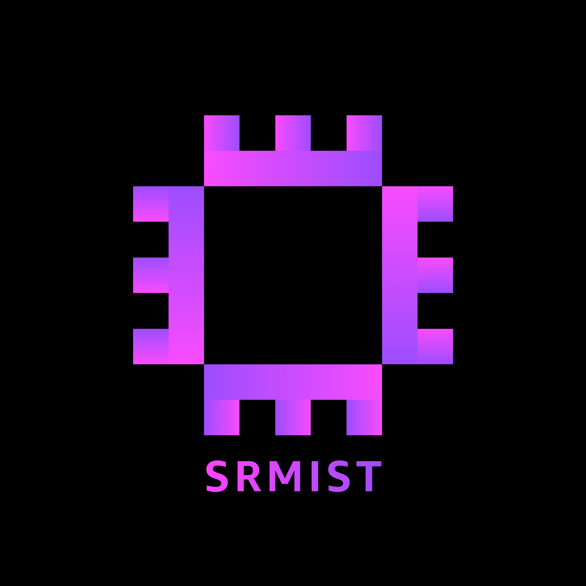

  

<h1 align="center">AWSSBG Recruitment Portal</h1>

  Recruitment portal for the AWS Student Builder Group (AWSSBG) at SRMIST — candidates fill a short form and chat with Nova, our AI recruitment chatbot, for the rest.

  
  
  
  
  
  
  
  

---

Made with ❤️ by Tech Team of AWS SBG at SRMIST

